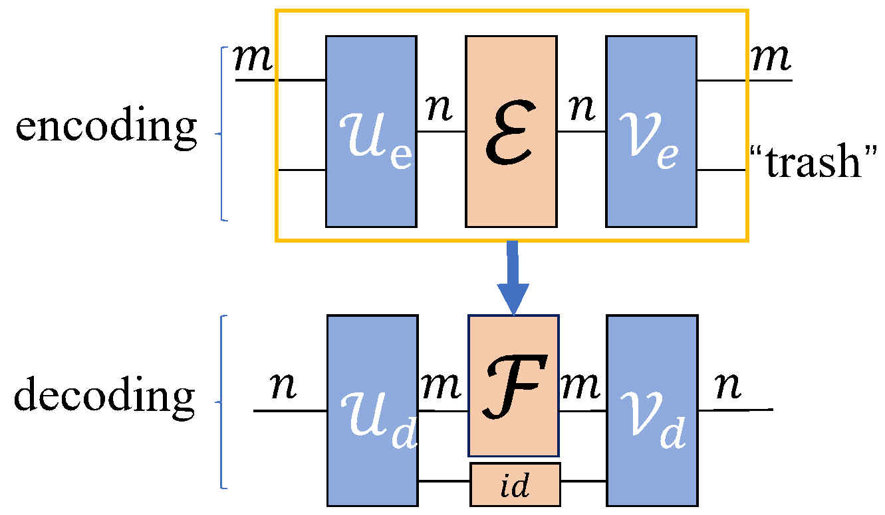

# QCAE: Quantum Circuit AutoEncoder

Welcome to the QCAE repository! Here, you'll find implementations for training Quantum Circuit Autoencoders in Qiskit and MindQuantum.

# Install packaged

pip install qiskit==0.45.2 mindquantum=0.9.0

# User Guide

QCAE is a powerful method designed to compress and encode information within quantum circuits. The framework is illustrated below:



QCAE utilizes an encoding process to compress information within a $2^n$ dimensional quantum channel to a $2^m$ channel, where $m \leqslant n$. The core source codes are located in the 'src' directory, with 'QCAE.py' containing the training framework for varQCAE.


num_latent, num_trash = 5, 1
num_qubits = num_latent + num_trash
qcae = QCAE(num_latent=num_latent, num_trash=num_trash)
mu, sigma = 0, 0.2
pqc = RealAmplitudes(num_qubits=num_qubits, reps=1)
target_op_list = []
for i in range(10):
    params = np.random.normal(mu, sigma, len(pqc.parameters))
    target_op_list.append(pqc.assign_parameters(parameters=params))
res, hist = qcae.run(target_op_list=target_op_list, noValidation=True)

Explore the 'experiments' directory for detailed experiments, and check out the results in the 'results' and 'results/figs' directories.

# Citation

If you use this code, please cite our paper:

```
@article{wu2023quantum,
  title={Quantum Circuit AutoEncoder},
  author={Wu, Jun and Fu, Hao and Zhu, Mingzheng and Xie, Wei and Li, Xiang-Yang},
  journal={arXiv preprint arXiv:2307.08446},
  year={2023}
}
```
Feel free to contribute and enhance the capabilities of QCAE!
